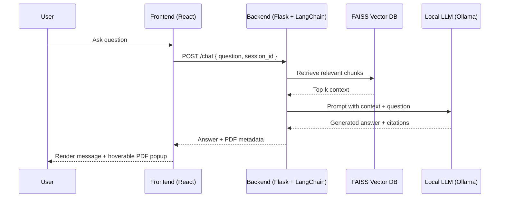
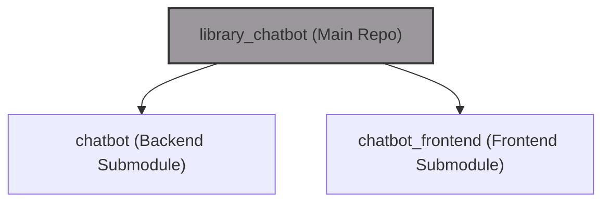
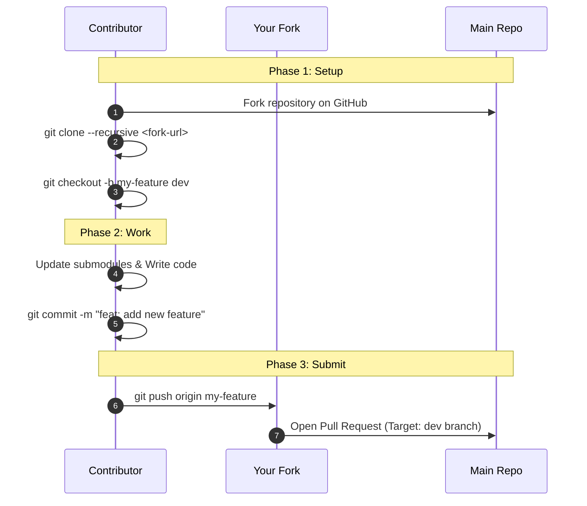

# Library Chatbot 📚💬

[](#)
[](#)
[](#)
[](#)
[](#)

A privacy-focused, AI-powered RAG (Retrieval-Augmented Generation) assistant for university libraries. It answers policy and research questions using local LLMs (via Ollama) by retrieving context from uploaded PDF regulations.

Built with a modular **Git Submodule** architecture, allowing the backend and frontend to be developed and versioned independently.
## Table of Contents
- [Architecture Overview](#architecture-overview)
- [Architecture & UML Diagrams](#architecture--uml-diagrams)
- [Directory Structure](#directory-structure)
- [Configuration Reference](#configuration-reference)
- [RAG Pipeline Workflow](#rag-pipeline-workflow)
- [API Endpoints](#api-endpoints)
- [Key Features](#key-features)
- [Installation](#installation)
- [Versioning](#versioning)
- [Contributing](#contributing)
- [License](#license)

## Architecture Overview
The repository acts as an orchestrator that pins two Git submodules:
- **`chatbot`** – Python/Flask backend implementing LangChain-powered RAG with FAISS and Local LLM integrations.
- **`chatbot_frontend`** – React UI that chats with the backend, streams answers, and renders PDF source popups.
- 
Submodules allow independent iteration of frontend and backend while keeping a single release cadence from the main repo.

### Tech Stack
* **Frontend:** React 18 (Create React App), Axios, React Markdown (for rendering bot responses), Recharts (for analytics).
* **Backend:** Python 3.10+, Flask, LangChain, FAISS.
* **AI/ML:** Ollama (Local LLM), SentenceTransformers (Embeddings).
* **Database:** PostgreSQL.
  

## Architecture & UML Diagrams
### RAG Flow (Sequence)


### Submodule Layout (Graph)


## Directory Structure
```text
library_chatbot/
├── chatbot/                        # [Submodule] Backend (Flask, RAG, FAISS)
│   ├── app/                        # Main application source code
│   │   ├── chat/                   # Chat routes and logic
│   │   └── utils.py                # RAG and utilities
│   ├── data/
│   │   └── pdfs/                   # Directory where uploaded PDFs live
│   ├── scripts/                    # Database and FAISS utility scripts
│   ├── fine_tuning_data.jsonl      # JSONL data for model fine-tuning
│   ├── requirements.txt            # Python dependencies
│   └── setup_venv.sh               # Backend environment setup script
│
├── chatbot_frontend/               # [Submodule] Frontend Repository
│   ├── frontend/                   # Main React Application
│   │   ├── public/                 # Static assets
│   │   ├── src/
│   │   │   └── components/         # UI Components (ChatWidget, PDFPopup)
│   │   └── package.json            # React dependencies
│   └── chatbot-widget/             # Standalone widget build (if applicable)
│
├── check_status.sh                 # Script to check health of services
├── start.sh                        # Full installation and startup script
├── start_app.sh                    # Quick startup script for daily use
└── STARTUP_GUIDE.md                # Detailed manual setup guide
```

## Configuration Reference
| Variable | Description | Default | Required |
| --- | --- | --- | --- |
| `OLLAMA_BASE_URL` | URL where your local Ollama instance is running. | `http://localhost:11434/v1` | ✅ |
| `LLM_MODEL` | The Ollama model to use for generation (e.g., llama3, mistral). | `hf.co/unsloth/Qwen3-4B-Instruct-2507-GGUF:Q8_0` | ✅ |
| `EMBEDDING_MODEL` | Local SentenceTransformer model for vectorizing PDFs. | `sentence-transformers/paraphrase-multilingual-MiniLM-L12-v2` | ✅ |
| `VECTOR_STORE_PATH` | Filesystem path for FAISS index persistence. | `./vectorstore` | ⬜ |
| `CHUNK_SIZE` | Document chunk size (tokens/characters) during ingestion. | `500` | ⬜ |
| `CHUNK_OVERLAP` | Overlap between chunks to preserve context. | `50` | ⬜ |
| `ALLOW_FILE_TYPES` | Comma-separated whitelist of uploadable formats (e.g., `pdf`). | `pdf` | ⬜ |
| `MAX_FILE_SIZE_MB` | Maximum upload size per document. | `10` | ⬜ |
| `PDF_FOLDER_PATH` | Directory where PDFs are stored for download. | `./data/pdfs` | ✅ |
| `DATABASE_URL` | PostgreSQL connection string.. | `postgresql://postgres@localhost/hu_chatbot2` | ✅ |
| `FRONTEND_URL` | Allowed origin for CORS between frontend and backend. | `http://localhost:3000` | ✅ |


## RAG Pipeline Workflow
1.  **Ingestion:** PDFs are manually placed into the `data/pdfs` folder and processed/embedded using `sentence-transformers`.
2.  **Indexing:** FAISS stores the vector embeddings locally at `VECTOR_STORE_PATH` for fast retrieval.
3.  **Retrieval:** When a question arrives, the backend queries FAISS to find the most relevant document chunks via cosine similarity.
4.  **Generation:** The retrieved context and user prompt are sent to the **local LLM (via Ollama)** to generate a grounded response.
5.  **Smart Citation:** The backend cleans metadata and maps the answer to specific PDF pages.
6.  **Delivery:** The final answer and source metadata are returned as a JSON response to the Frontend, which renders the answer and the interactive **PDF Popup**.

## API Endpoints
- `POST /chat` – Main chat endpoint. Parameters: `question`, `session_id` (body JSON). Returns answer + source metadata.
- `GET /download/<filename>` – Download a stored PDF referenced by citations.

## Key Features
- **RAG Powered**: Combines LangChain, FAISS, and Local LLMs (Ollama) to ground answers in uploaded PDFs.
- **Smart Source Citation (v0.2.0)**: Hoverable blue PDF icon reveals a polished card with filename, page number, and a download button.
- **Modular via Git Submodules**: Backend and frontend evolve independently while the main repo manages versions.
- **Developer-Friendly Scripts**: `start.sh` (full setup), `start_app.sh` (quick start), and `check_status.sh` (runtime diagnostics).
- **Admin Dashboard**: Built-in analytics to track chat stats, review user feedback, and manage the knowledge base.

## Installation
1. **Clone with submodules**
   **Option A: Using HTTPS (Recommended for most users)**
    ```bash
    git clone --recurse-submodules https://github.com/Mehmetmrtgl/library_chatbot.git
    cd library_chatbot
    ```
   **Option B: Using SSH (For developers with SSH keys)**
    ```bash
    git clone --recurse-submodules git@github.com:Mehmetmrtgl/library_chatbot.git
    cd library_chatbot
    ```
2. **First-time setup (recommended)** – installs Python deps, creates DB, installs npm packages, and starts everything:
   ```bash
   ./start.sh
   ```
3. **Subsequent runs** – reuse existing environments and start services quickly:
   ```bash
   ./start_app.sh
   ```
4. **Check component status** (optional):
   ```bash
   ./check_status.sh
   ```

> Both startup scripts expect Ollama (for local models) to be available at `http://localhost:11434`. See `STARTUP_GUIDE.md` for manual steps and troubleshooting.


## Versioning
Semantic Versioning; current release: **v0.2.0** (introduces the smart PDF citation popup).

## Contributing
We welcome contributions! Please follow the workflow below to ensure a smooth collaboration.

### Important Rule
**Direct Pull Requests to the `main` branch are restricted.**
External contributors must target the **`dev`** branch. The `main` branch is reserved for stable releases only.

### Workflow

1.  **Fork & Clone**
    Fork the repository and clone it locally with submodules:
    ```bash
    git clone --recurse-submodules https://github.com/Mehmetmrtgl/library_chatbot.git
    cd library_chatbot
    ```

2.  **Check/Create `dev` Branch**
    Since this project is new, the `dev` branch might not exist yet.
    * **If `dev` exists:** Checkout to it.
    * **If `dev` DOES NOT exist (You are the first contributor):** Create it from `main`.

     
    ```bash
    # Check remote branches
    git branch -r 

    # If origin/dev exists:
    git checkout dev

    # If origin/dev DOES NOT exist (First time setup):
    git checkout -b dev main
    ```

3.  **Create Your Feature Branch**
    Always create your feature branch off `dev`:
    ```bash
    git checkout -b feature/amazing-feature dev
    ```

4.  **Develop & Commit**
    * Make changes in submodules (`chatbot` or `chatbot_frontend`).
    * Commit submodule changes first, then the main repo.
    ```bash
    git add .
    git commit -m "feat: added new amazing feature"
    ```

5.  **Open a Pull Request**
    * Push your branch to your fork.
    * Open a Pull Request targeting the **`dev`** branch of this repository.
    * *(Note: If `dev` doesn't exist on the main repo yet, please mention in your PR that it should be created).*

### Git Flow Visualization


## License
This project is licensed under the MIT License - see the LICENSE file for details.
